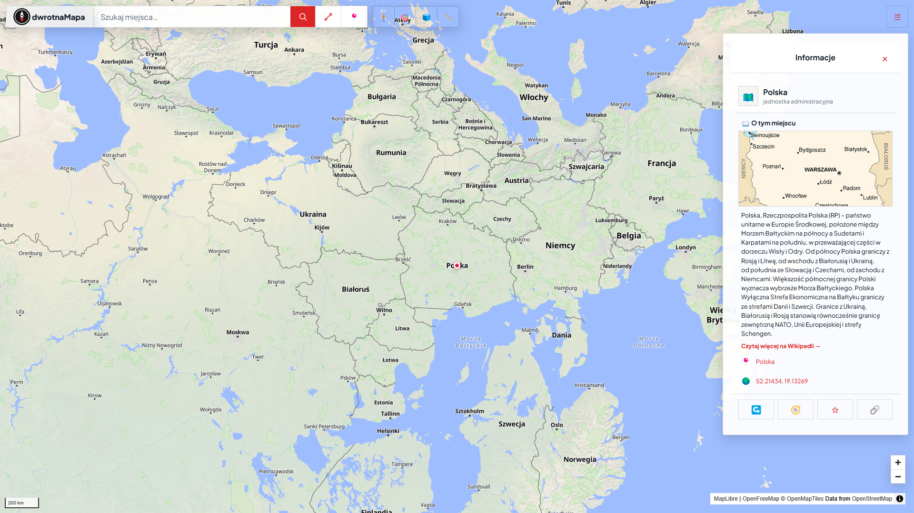

# <a href="https://odwrotnamapa.pl/">Odwrotna Mapa</a>

**Twoja mapa. Twoje zasady. Spójrz na świat inaczej.**

---

## 💡 O Projekcie

**Odwrotna Mapa** to coś więcej niż tylko mapa z orientacją południową na górze. To **protest przeciwko utartym schematom kartograficznym** i ograniczonym interfejsom popularnych komercyjnych map.

Większość ludzi przyjmuje północ na górze mapy jako domyślną i jedyną słuszną prawidłość. Odwrotna Mapa udowadnia, że orientacja przestrzenna to tylko kwestia umowy, a zmiana perspektywy potrafi całkowicie odmienić sposób, w jaki postrzegamy geografię, odległości i relacje między miejscami.

Projekt wyewoluował z prostego konceptu wizualnego w **pełnoprawne, zaawansowane narzędzie GIS i geodezyjno-turystyczne**, zbudowane w oparciu o wolne dane (**OpenStreetMap**) oraz nowoczesny silnik renderowania wektorowego (**MapLibre GL**).

---

## ✨ Kluczowe Funkcje

### 🗺️ Pełna Swoboda Perspektywy
* **Swobodna rotacja i nachylenie 3D:** Obracaj mapę pod dowolnym kątem, przełączaj widok w tryb 3D i przełam rutynę tradycyjnych nawigacji.
* **Tryb Odwrócony:** Szybkie przełączanie na orientację południową na górze ekranu.

### 🔍 Zaawansowane Wyszukiwanie i Odkrywanie
* **Multi-engine search:** Łączymy potęgę silników **Nominatim** oraz **Photon** z autorskim indeksowaniem polskich lokalizacji.
* **Odkrywanie w promieniu widoku:** Wyszukuj interesujące obiekty (POI), zabytki i punkty usługowe w bieżącym kadrze mapy.

### 📐 Narzędzia Pomiarowe i Planowanie
* **Planowanie tras:** Precyzyjne wyznaczanie tras samochodowych, rowerowych i pieszych.
* **Pomiary odległości:** Szybkie narzędzie do mierzenia dystansów w linii prostej oraz wzdłuż wyznaczonych ścieżek.

### 📸 Widok Ulicy (Street View)
* **Integracja z Mapillary:** Przeglądaj otwarte zdjęcia z poziomu ulicy bezpośrednio na mapie, bez polegania na zamkniętych ekosystemach.

### 🎨 Personalizacja i Eksport
* **Motywy i warstwy:** Zmieniaj style mapy i dostosowuj interfejs do własnych preferencji.
* **Eksport do PNG:** Generuj czyste, wysokiej jakości pliki graficzne z wybranym fragmentem mapy – idealne do druku, prezentacji czy na bloga.

### 🔒 Prywatność i Wolność
* **Brak śledzenia:** Szanujemy Twoją prywatność – nie gromadzimy historii wyszukiwań ani danych lokalizacyjnych.
* **Open Source:** Aplikacja bazuje na otwartym oprogramowaniu i społecznościowych danych OpenStreetMap.

---

## 📱 Dostępność i Platformy

Odwrotna Mapa jest dostępna na niemal każdym urządzeniu:
* 🌐 **Web / PWA:** Uruchom bezpośrednio w przeglądarce jako Progressive Web App (`odwrotnamapa.pl`).
* 📱 **Android:** Dostępna w postaci pakietu APK oraz w repetytorium **F-Droid**.
* 💻 **Desktop:** Wersja stacjonarna oparta na Electron (Windows / Linux / macOS).

---

## 🛠️ Stos Technologiczny

* **Map Engine:** MapLibre GL JS
* **Data Sources:** OpenStreetMap, Mapillary
* **Geocoding:** Nominatim, Photon
* **Routing:** OSRM / GraphHopper
* **Platform:** Web / PWA / Electron / Android (Capacitor/WebView)

---

## 🤝 Wkład w rozwój (Contributing)

Chcesz pomóc w rozwoju projektu? Każda pomoc jest mile widziana!
1. Zgłaszaj błędy i propozycje funkcji w zakładce **Issues**.
2. Twórz własne modyfikacje i zgłaszaj **Pull Requests**.
3. Wspieraj otwarte dane – dodawaj miejsca do [OpenStreetMap](https://www.openstreetmap.org)!

---

## 📄 Licencja

Projekt jest udostępniany na licencji **MIT**. Dane mapowe pochodzą z serwisu © [OpenStreetMap](https://www.openstreetmap.org/copyright) na licencji ODbL.

---
📨 Kontakt:
odwrotnamapa@protonmail.com

☕️ Buy Me a Coffee:
https://buymeacoffee.com/odwrotnamapa

🪙 Bitcoin:
bc1qk4ef9ssyt5tjw2c0xrp8w5sthuwp9vw9acc96t
